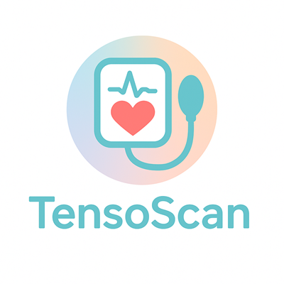
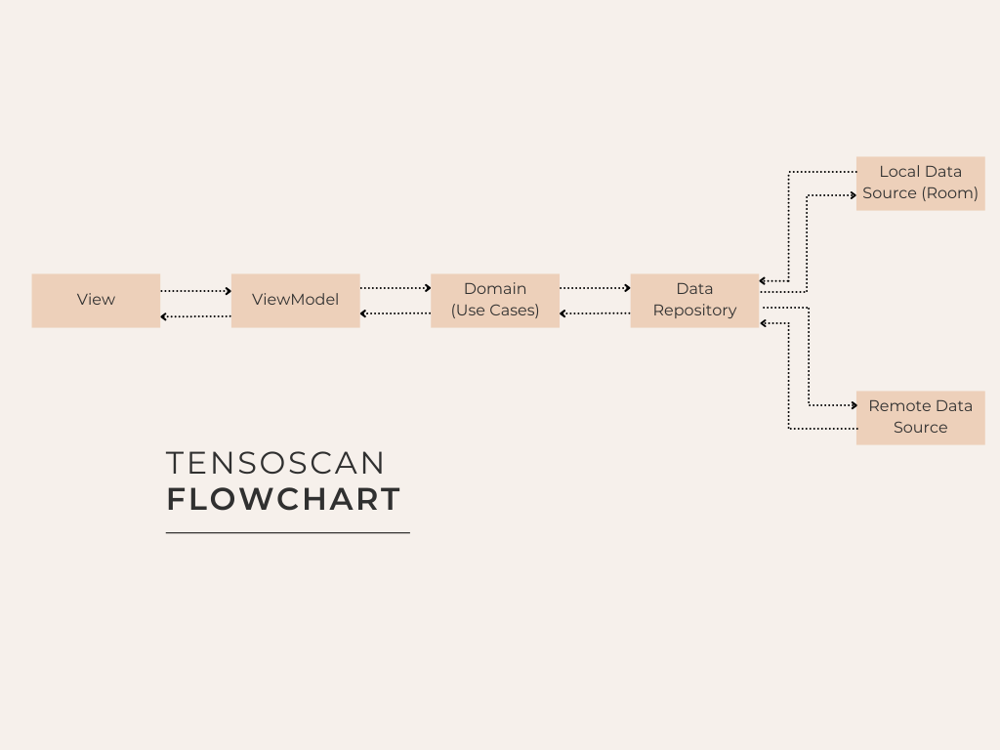

# 📲 TensoScan — AI-powered Blood Pressure Monitor Companion

  

> **Turn your traditional blood pressure monitor into a smart health tracker**
>
> TensoScan automatically scans and recognizes the digits on your monitor's screen using AI. It saves each reading and builds a personal history to help you track your blood pressure over time

---

  

---

## 🚀 Key Features

- 🧠 **AI-based digit recognition** from blood pressure monitors
- 📷 Built-in **CameraX integration** for accurate and fast scans
- 🧾 **Historical tracking** of blood pressure measurements
- 📊 Interactive graphs and trends
- 🌐 Data storage using Room
- ⚡ Highly optimized with Kotlin Flows & Coroutines

---

## 🧱 Modern Architecture

TensoScan is built with modern, scalable architecture principles:

- 🧼 Clean Code + SOLID Principles
- ✅ Testable, modular and maintainable
- 🔄 Reactive data flow with Kotlin StateFlow
- 🔐 Dependency Injection with Koin

---

  

---

🧰 Tech Stack
| Category          | Technology                      |
|------------------|----------------------------------|
| 🖼️ UI             | Jetpack Compose                 |
| 🤖 Language        | Kotlin                          |
| 🏗️ Architecture   | MVVM + Clean Architecture       |
| 🔍 Vision AI       | CameraX + OCR Model             |
| 🌐 Networking      | Retrofit + Coroutines           |
| 💾 Storage         | Room Database                   |
| 💉 DI              | Koin                            |
| 🔄 Reactive        | Kotlin Flows + StateFlow        |
| 🖼️ Images          | Coil                            |
| 🧪 Testing         | JUnit, MockK, Compose Testing   |

---

🧠 Artificial Intelligence
- Custom OCR model trained to accurately detect digits from reflective LCD screens
- Optimized for on-device performance and low battery usage
- Trained using data augmentation for better accuracy across devices

---

📄 License
This project is licensed under the MIT License

---

